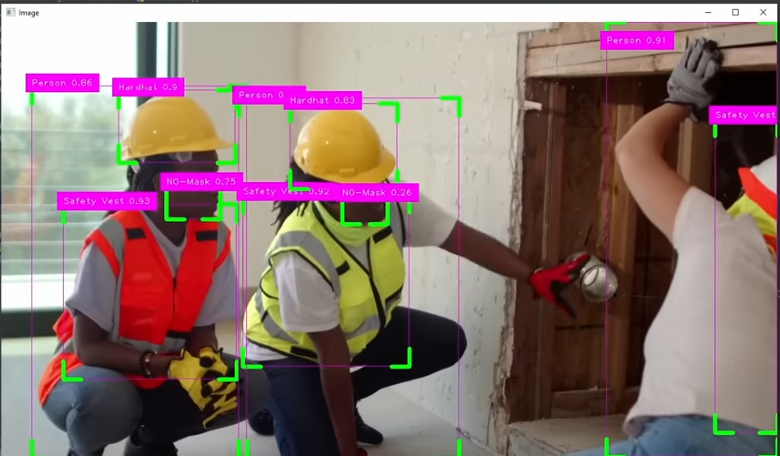
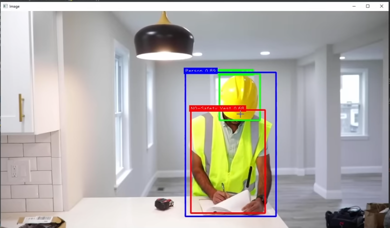

# Project 3 - PPE Detection (Custom Training)

## tools
1. Google colab: https://colab.research.google.com/drive/1QRc14-_o8b1Sp-DogwGBz74tW4sp6dVN?usp=sharing
2. PPE Detection Image Dataset: https://universe.roboflow.com/hx-hezqh/ppe-detection-yfmym
3. Script to run:
    * $ mkdir venv
    * $ virtualenv -p /usr/bin/python3.11 venv/
    * $ source venv/bin/activate
    * to deactivate: $ deactivate
    * pip install -r requirements.txt
4. python3.11 main.py
5. Demo

